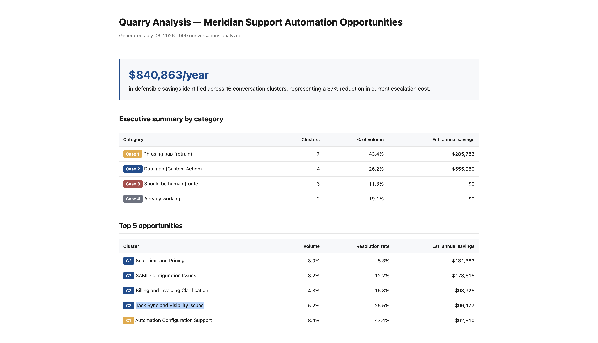

<div align="center">

# Quarry

**Mine unresolved AI support conversations for automation opportunities.**

[](https://opensource.org/licenses/MIT)
[](https://www.python.org/downloads/)
[]()

</div>

---

For a customer, an AI support conversation is binary — the bot solved my problem or it didn't.

For a business, it's not binary. Thousands of conversations, dozens of underlying reasons, different failure modes for each. A raw resolution rate (*"42%"*) tells a business nothing about **what to do next**.

Quarry finds the patterns hiding in that mess. It clusters unresolved conversations by semantic meaning, labels each cluster, and diagnoses why each cluster is failing — whether the fix is a retraining exercise, a backend integration, or a decision to keep humans in the loop.

The output is a **diagnostic layer**: for each cluster, what to do about it and what it's worth. Businesses can then act on specific opportunities instead of trying to improve a single averaged number.

Quarry is open-source and works with conversation data from any AI support agent.

---

## 📦 What Quarry produces

Two artifacts:

- **`data/processed/analysis.json`** — the pipeline's real product. A structured record per cluster containing its label, size, current resolution rate, failure classification (data gap / phrasing gap / should-be-human / already-working), a specific recommended fix, and an estimated dollar impact. This is what downstream tools consume.

- **`data/output/report.html`** — one example of what a downstream tool might build on top of that JSON. In this repo, an executive-facing report designed for a VP of Support.

<div align="center">
  
</div>

Anyone consuming the JSON can build their own dashboard, deck, or downstream pipeline. The HTML report is a demonstration, not the tool.

---

## 🚀 How to run it

The pipeline runs end-to-end in one command. **No API keys required.** All models run locally.

### Prerequisites

- Python 3.10 or newer
- [Ollama](https://ollama.com/download) installed and running, with `llama3.1:8b` pulled:

```bash
  ollama pull llama3.1:8b
```

### Setup

```bash
git clone https://github.com/siddharth-murugesan/quarry.git
cd quarry
python3 -m venv venv
source venv/bin/activate
pip install -e .
```

### Run

```bash
python scripts/run_pipeline.py
```

The pipeline is **idempotent** — it skips stages whose outputs already exist. Pass `--force` to regenerate everything.

Open the report:

```bash
open data/output/report.html
```

---

## 🔧 How it works

Quarry is a four-stage pipeline. Each stage reads from disk, produces one artifact, and moves on. Stages are independently runnable and inspectable.

### Stage 0 — Dataset

A synthetic conversation dataset lives at `data/raw/conversations.jsonl`, committed to the repo for reproducibility. To rebuild it (requires a Gemini API key), run `scripts/00_generate_dataset.py`. The pipeline never regenerates the dataset automatically.

### Stage 1 — Embed, reduce, cluster, label

Each conversation is encoded into a **384-dimensional vector** using `sentence-transformers/all-MiniLM-L6-v2`. **UMAP** compresses to 5 dimensions while preserving neighborhood structure — clustering works better in low-dimensional space where distance metrics stay meaningful. **HDBSCAN** then discovers clusters based on density, adapting to different cluster densities and honestly refusing to force one-off messages into a group (they go into a noise bucket). Finally, **Llama 3.1 8B** running locally on Ollama looks at the 8 most representative messages from each cluster and generates a short human-readable label.

### Stage 2 — Business analysis

Each cluster is classified into one of four cases:

| Case | Meaning | Fix |
| --- | --- | --- |
| **1** | Phrasing gap | Retrain / add phrasing variants |
| **2** | Data gap | Wire a backend integration |
| **3** | Should be human | Route to the right team; do not automate |
| **4** | Already working | Leave alone |

For actionable clusters, a per-case **capture rate** estimates what fraction of currently-escalated conversations the fix would actually resolve. Dollar savings are computed against the customer's monthly volume and cost assumptions.

### Stage 3 — Report

The analysis is rendered into an HTML report with an executive summary, top opportunities, an interactive cluster chart, and per-cluster recommendation cards.

---

## 📊 Applying Quarry to your own data

The pipeline is generalized; the demonstration is not. The Meridian scenario in this repo uses specific assumptions:

| Assumption | Value |
| --- | --- |
| Monthly conversation volume | 42,000 |
| Human handling cost | $8 per conversation (fully-loaded) |
| AI outcome fee | $0.99 per resolution *(Fin's public pricing)* |
| Capture rate — backend integrations | 70% |
| Capture rate — retraining | 40% |

These live as constants at the top of `quarry/analysis.py`. To apply Quarry to your own business, replace them with your reality and rerun. The model scales linearly with these inputs.

To apply it to your own conversation data, produce a JSONL file with the same schema as `data/raw/conversations.jsonl`:

```json
{"text": "...", "was_resolved_by_fin": false}
```

> **Note:** the pipeline itself does not require a `true_intent` field — that field exists in the sample dataset only for validating cluster quality during development. In production, cluster quality is validated by human inspection of a sample from each discovered cluster.

---

## ⚠️ What Quarry does not do

- **Not connected to any AI support agent's APIs.** Quarry analyzes conversation data offline.
- **Not an autofixer.** Quarry surfaces opportunities and recommends actions; a human implements them.
- **Not a substitute for judgment.** Cluster labels and case classifications are best-guess and should be reviewed by someone familiar with the business before acting.
- **Dollar figures are estimates.** Based on stated assumptions. Directionally useful, not precise.

---

## 📄 License

MIT. See [`LICENSE`](LICENSE).

## 👤 About

Built by [**Siddharth Murugesan**](https://github.com/siddharth-murugesan) as an exploration of what a Forward Deployed Engineer's deliverable looks like when applied to AI support automation.
